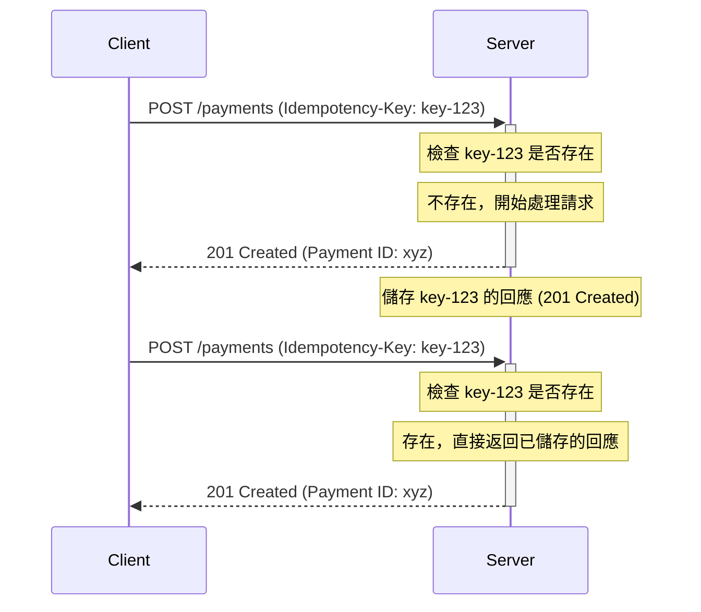

# API 中的冪等性

- **難度**: 7
- **重要性**: 5
- **標籤**: `API Design`, `Idempotency`, `Reliability`

## 問題詳述

什麼是 API 的冪等性 (Idempotency)？為什麼它在 API 設計中很重要？請舉例說明如何透過設計來確保 API 的冪等性。

## 核心理論與詳解

冪等性是源自數學的一個概念，指一個操作無論執行一次還是多次，其產生的效果都是相同的。在 API 的上下文中，一個冪等的請求意味著客戶端可以重複發送同一個請求，而不用擔心會產生額外的副作用或重複的結果。

### 為什麼冪等性很重要？

在分散式系統中，網路是不可靠的。客戶端發送一個請求後，可能會因為網路延遲、超時或伺服器故障而沒有收到回應。在這種情況下，客戶端無法確定請求是否已成功處理。

- **如果請求未被處理**：客戶端需要重試。
- **如果請求已被處理，但回應丟失**：客戶端重試可能會導致重複操作（例如，重複創建訂單、重複扣款）。

冪等性就是為了解決這個問題。如果一個 API 操作是冪等的，客戶端就可以安全地重試該請求，直到獲得明確的回應為止，而無需擔心重複執行會帶來災難性後果。

### HTTP 方法與冪等性

根據 HTTP/1.1 規範，不同的 HTTP 方法具有不同的冪等性特徵：

| HTTP 方法 | 冪等 (Idempotent) | 安全 (Safe) | 描述 |
| :--- | :--- | :--- | :--- |
| **GET** | ✅ 是 | ✅ 是 | 讀取資源，不應有任何副作用。重複讀取結果相同。 |
| **HEAD** | ✅ 是 | ✅ 是 | 類似 GET，但只返回標頭。 |
| **OPTIONS**| ✅ 是 | ✅ 是 | 獲取伺服器支援的方法。 |
| **PUT** | ✅ 是 | ❌ 否 | **完整替換**一個資源。第一次請求創建或更新了資源，後續請求只會重複同樣的更新，結果不變。 |
| **DELETE** | ✅ 是 | ❌ 否 | 刪除一個資源。第一次請求刪除了資源，後續請求會回傳 `404 Not Found`，但資源的狀態（已被刪除）保持不變。 |
| **POST** | ❌ 否 | ❌ 否 | **創建**一個子資源。每次調用都可能創建一個新的、唯一的資源。例如，連續 POST `/orders` 會創建多個訂單。 |
| **PATCH** | ❌ 否 | ❌ 否 | **部分更新**一個資源。通常不是冪等的。例如，`PATCH /articles/1` `{ "action": "increment_views" }` 會導致瀏覽次數不斷增加。 |

**注意**：`PATCH` 是否冪等取決於其具體操作。如果 `PATCH` 用於設定一個確定的值（如 `PATCH /articles/1 {"status": "published"}`），那麼它就是冪等的。但如果用於執行一個相對操作（如增加計數器），它就不是。

### 如何設計冪等的 API (特別是針對 POST)

`GET`, `PUT`, `DELETE` 等方法天然具有冪等性，但最棘手的 `POST` 方法（通常用於創建資源）預設不是冪等的。為了讓創建操作也變得安全可重試，我們需要引入一個**冪等性金鑰 (Idempotency Key)**。

#### 實現步驟

1. **客戶端生成唯一金鑰**：客戶端在發送 `POST` 請求時，生成一個唯一的標識符（例如 UUID），並將其放在 HTTP 標頭中，如 `Idempotency-Key: <unique-key>`。

2. **伺服器儲存金鑰與回應**：
    - 當伺服器第一次收到帶有某個 `Idempotency-Key` 的請求時，它會正常處理這個請求。
    - 在處理完成後，伺服器將這個 `Idempotency-Key` 與請求的**結果 (回應狀態碼和內容)** 一起儲存起來，並設定一個過期時間（例如 24 小時）。
    - 伺服器將處理結果返回給客戶端。

3. **伺服器處理重複請求**：
    - 如果伺服器再次收到帶有同一個 `Idempotency-Key` 的請求，它不會再次執行業務邏輯。
    - 相反，它會直接從儲存中查找該金鑰對應的歷史回應，並立即將這個**一模一樣的回應**返回給客戶端。

#### 流程圖



### 程式碼範例 (Go 中介軟體)

這是一個簡化的 Go Gin 中介軟體範例，展示了如何使用 Redis 實現冪等性檢查。

```go
// 如果需要，在此提供一個簡潔、核心的 Go 程式碼範例
// 程式碼必須精簡，僅用於輔助理解核心概念
package main

import (
    "net/http"
    "time"

    "github.com/gin-gonic/gin"
    "github.com/go-redis/redis/v8"
    "github.com/google/uuid"
)

// 假設有一個 Redis 客戶端
var redisClient *redis.Client

// 儲存的回應結構
type CachedResponse struct {
    StatusCode int
    Body       []byte
    Headers    http.Header
}

func IdempotencyMiddleware() gin.HandlerFunc {
    return func(c *gin.Context) {
        // 只對非冪等的 POST 方法進行處理
        if c.Request.Method != "POST" {
            c.Next()
            return
        }

        idempotencyKey := c.GetHeader("Idempotency-Key")
        if idempotencyKey == "" {
            c.Next()
            return
        }

        // 1. 檢查 Redis 中是否存在該金鑰
        redisKey := "idempotency:" + idempotencyKey
        val, err := redisClient.Get(c.Request.Context(), redisKey).Bytes()

        if err == nil {
            // 2. 如果存在，直接返回快取的回應
            var cachedResp CachedResponse
            // 假設 val 是 JSON 序列化的 CachedResponse
            // json.Unmarshal(val, &cachedResp)
            
            // 為了簡化，我們只返回一個標記
            c.JSON(http.StatusConflict, gin.H{"message": "Request already processed"})
            c.Abort()
            return
        }

        // 如果是 Redis 中沒有找到 key 的錯誤，則繼續
        if err != redis.Nil {
            c.JSON(http.StatusInternalServerError, gin.H{"error": "Redis error"})
            c.Abort()
            return
        }

        // 3. 如果不存在，則執行請求
        c.Next()

        // 4. 請求處理完畢後，儲存回應
        // 只儲存成功的或可預期的錯誤回應
        if c.Writer.Status() >= 200 && c.Writer.Status() < 500 {
            // 為了簡化，我們只儲存一個標記，實際應儲存完整回應
            // cachedResp := CachedResponse{ ... }
            // serializedResp, _ := json.Marshal(cachedResp)
            redisClient.Set(c.Request.Context(), redisKey, []byte("processed"), 24*time.Hour)
        }
    }
}

func main() {
    // 初始化 Redis Client...
    
    r := gin.Default()
    r.Use(IdempotencyMiddleware())

    r.POST("/payments", func(c *gin.Context) {
        // 模擬處理支付
        time.Sleep(1 * time.Second)
        c.JSON(http.StatusCreated, gin.H{
            "payment_id": uuid.New().String(),
            "status":     "success",
        })
    })

    r.Run(":8080")
}
```

### 總結

冪等性是建立健壯、可靠 API 的基石。它讓客戶端可以安全地重試因網路問題而失敗的請求。雖然 `GET`, `PUT`, `DELETE` 等方法在語義上是冪等的，但對於 `POST` 和某些 `PATCH` 操作，需要開發者透過**冪等性金鑰**等機制來手動實現，從而極大地提升系統的容錯能力和使用者體驗。
