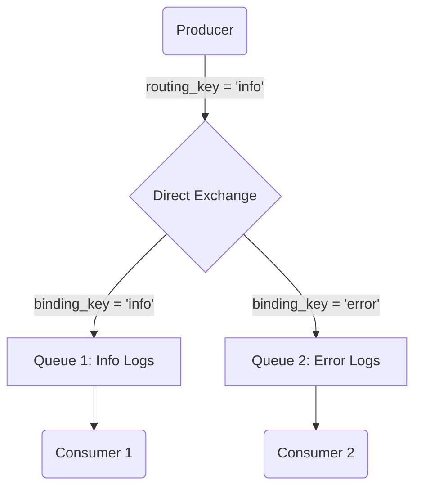
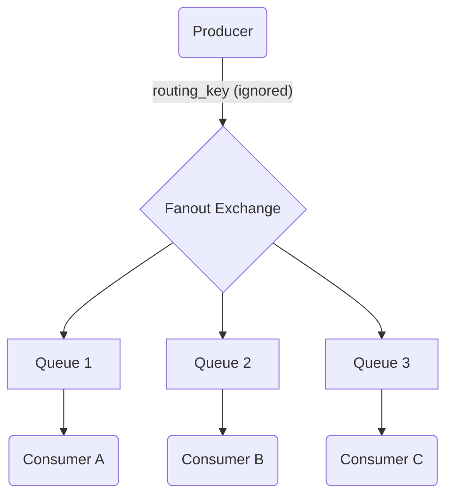
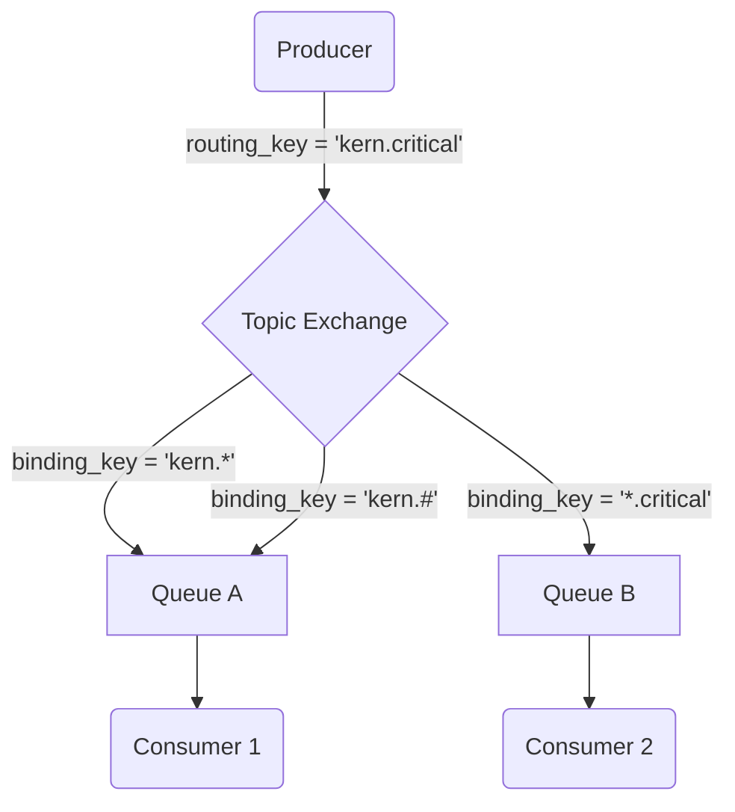
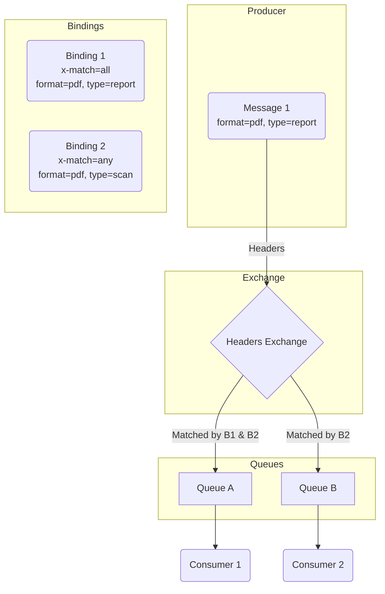

# RabbitMQ Exchange 類型詳解：Direct, Fanout, Topic, Headers

- **難度**: 6
- **重要性**: 5
- **標籤**: `RabbitMQ`, `Exchange`, `AMQP`

## 問題詳述

RabbitMQ 中的 Exchange 有哪些主要類型？它們各自的路由策略是什麼？請詳細解釋 Direct, Fanout, Topic, 和 Headers 交換機的運作方式和適用場景。

## 核心理論與詳解

在 RabbitMQ 中，**Exchange (交換機)** 是訊息傳遞模型的核心。生產者 (Producer) 並不直接將訊息發送到佇列 (Queue)，而是將訊息發送到交換機。交換機接收到訊息後，根據其類型和綁定 (Binding) 規則，將訊息路由到一個或多個佇列中。

理解不同交換機的類型和行為，是設計高效、可靠訊息系統的關鍵。

### 1. Direct Exchange (直接交換機)

- **路由策略**: 訊息的 `routing_key` 與綁定的 `binding_key` **完全匹配**。
- **運作方式**:
  1. 一個佇列使用一個 `binding_key` (例如 `pdf_process`) 綁定到一個 Direct 交換機。
  2. 當一個訊息帶著 `routing_key` (例如 `pdf_process`) 發送到該交換機時，交換機只會將訊息轉發到 `binding_key` 同樣為 `pdf_process` 的佇列。
  3. 如果訊息的 `routing_key` 與任何 `binding_key` 都不匹配，訊息將被丟棄。
- **適用場景**:
  - **點對點通訊**: 當需要將訊息明確地發送到某個特定的消費者時。
  - **任務分發**: 根據任務類型將工作分配給不同的背景工作程序 (Worker)。例如，`image_worker` 處理圖片，`log_worker` 處理日誌。

**示意圖**:

### 2. Fanout Exchange (扇形交換機)

- **路由策略**: **忽略 `routing_key`**，將訊息廣播到所有與之綁定的佇列。
- **運作方式**:
  1. 多個佇列可以綁定到同一個 Fanout 交換機。
  2. 當訊息發送到該交換機時，它會無條件地將訊息的一個副本發送到所有綁定的佇列。
  3. `routing_key` 會被完全忽略。
- **適用場景**:
  - **廣播/發布-訂閱**: 當需要將同一則訊息通知給所有相關的子系統時。例如，系統設定變更後，需要通知所有服務重新載入設定。
  - **即時通知**: 體育賽事比分更新、股票價格變動等。

**示意圖**:

### 3. Topic Exchange (主題交換機)

- **路由策略**: 訊息的 `routing_key` 與綁定的 `binding_key` 進行**模式匹配 (Pattern Matching)**。
- **運作方式**:
  1. `routing_key` 和 `binding_key` 都是由 `.` 分隔的字串，例如 `stock.usd.nyse`。
  2. `binding_key` 中可以包含兩種特殊的萬用字元：
     - `*` (星號): 匹配**一個**單字。
     - `#` (井號): 匹配**零個或多個**單字。
  3. 交換機將訊息路由到 `binding_key` 模式能匹配 `routing_key` 的佇列。
- **適用場景**:
  - **多維度的訊息路由**: 當訊息需要根據多個標準進行分類和訂閱時。例如，日誌系統可以根據 `log_level.source.module` 來路由日誌。
    - `*.error.*` 可以接收所有來源的錯誤日誌。
    - `debug.#` 可以接收所有 debug 等級的日誌。
    - `info.auth.login` 只接收認證模組的登入日誌。

**示意圖**:

*在這個例子中，`Q1` 和 `Q2` 都會收到訊息。*

### 4. Headers Exchange (標頭交換機)

- **路由策略**: **忽略 `routing_key`**，根據訊息的**標頭 (Headers)** 屬性進行匹配。
- **運作方式**:
  1. 佇列在綁定到 Headers 交換機時，會提供一組鍵值對的參數。
  2. 綁定時可以指定一個 `x-match` 參數，它有兩個值：
     - `all` (預設): 訊息的標頭必須**完全匹配**綁定時指定的所有鍵值對。
     - `any`: 訊息的標頭只要**匹配**綁定時指定的**任意一個**鍵值對即可。
  3. 訊息的標頭是一個鍵值對的集合。
- **適用場景**:
  - **非字串的路由規則**: 當路由邏輯比簡單的字串匹配更複雜時。例如，根據數值、布林值等進行路由。
  - **複雜的條件組合**: 當需要 `AND` (`all`) 或 `OR` (`any`) logic 組合時。

**示意圖**:

*在這個例子中，`Message 1` 會被路由到 `Queue A` 和 `Queue B`。*

## 總結

| 交換機類型 | 路由策略 | `routing_key` | 適用場景 |
| :--- | :--- | :--- | :--- |
| **Direct** | 完全匹配 | 必要 | 點對點、單播 |
| **Fanout** | 廣播 | 忽略 | 發布/訂閱、廣播 |
| **Topic** | 模式匹配 | 必要 | 多維度、靈活的訂閱 |
| **Headers** | 標頭屬性匹配 | 忽略 | 複雜條件、非字串路由 |

選擇哪種交換機取決於你的業務需求。從簡單的 Direct 和 Fanout 到複雜的 Topic 和 Headers，RabbitMQ 提供了極大的靈活性來應對各種訊息路由場景。在實踐中，Topic 交換機因其強大的靈活性而備受青睞。
