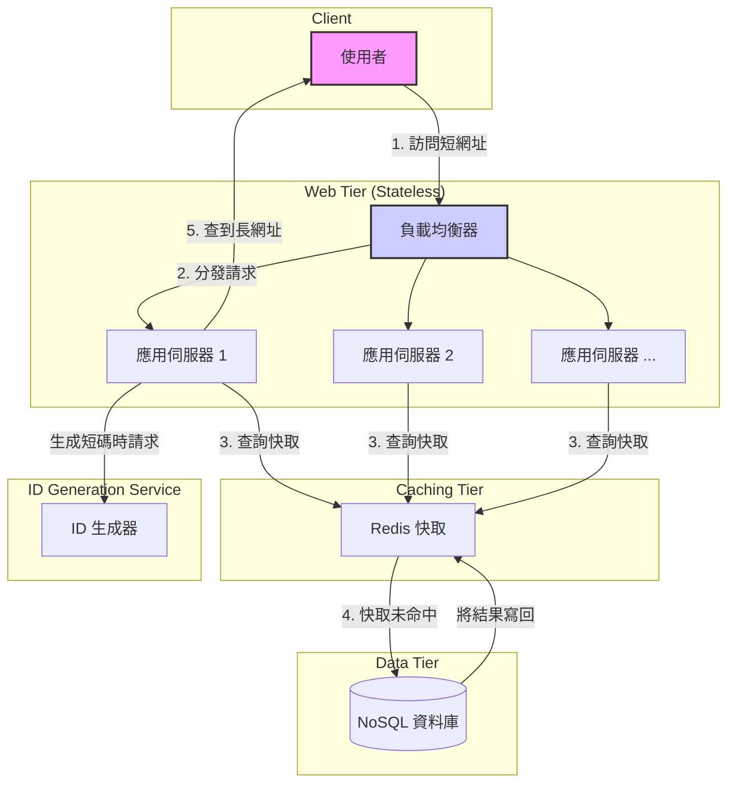

# 如何設計一個高併發的短網址系統？

- **難度**: 8
- **重要程度**: 5
- **標籤**: `System Design`, `High Concurrency`, `Scalability`

## 問題詳述

短網址（Short URL）服務是網際網路上常見的應用，例如 bit.ly、t.co 等。請設計一個高併發、高可用的短網址系統。你需要考慮以下幾點：

1. **核心功能**：如何將長網址轉換為短網址？如何將短網址重定向回原始的長網址？
2. **短碼生成策略**：如何設計短碼（Short Code）的生成演算法，以確保其唯一性、高效性和盡可能短？
3. **儲存系統**：你會選擇哪種類型的資料庫（SQL vs. NoSQL）來儲存長短網址的對應關係？為什麼？
4. **高併發與高可用**：如何應對大量的讀取（重定向）和寫入（生成）請求？如何確保系統的可用性？
5. **進階功能**：如何設計自訂短網址、過期時間、點擊統計等功能？

## 核心理論與詳解

設計一個短網址系統是系統設計面試中的經典問題，它能很好地考察候選人對系統架構、資料庫選擇、快取策略和可擴展性等多方面的綜合能力。

### 1. 核心功能分析

- **寫入操作 (生成短網址)**:
  1. 使用者輸入一個長網址。
  2. 系統為該長網址生成一個全域唯一的短碼。
  3. 系統儲存長網址和短碼的對應關係。
  4. 系統返回完整的短網址（例如 `https://myshort.url/短碼`）。
- **讀取操作 (重定向)**:
  1. 使用者在瀏覽器中訪問一個短網址。
  2. 系統根據短網址中的短碼，查詢對應的長網址。
  3. 系統返回一個 HTTP `301` (永久重定向) 或 `302` (臨時重定向) 狀態碼，並在 `Location` 標頭中附上長網址。
  4. 瀏覽器自動重定向到該長網址。

**讀寫比例**：短網址系統是一個典型的「讀多寫少」的應用。一個熱門的短網址可能會被點擊數百萬次，但它只被創建一次。因此，設計上應優先優化讀取性能。

### 2. 短碼生成策略

這是系統的核心之一。一個好的生成策略需要平衡唯一性、長度、複雜度和生成效率。

#### 策略一：雜湊函數 + 碰撞解決

- **方法**: 對長網址進行 MD5 或 SHA-256 雜湊，然後取前 N 個字元作為短碼。
- **優點**: 簡單直觀。
- **缺點**:
  - **碰撞問題**: 不同的長網址可能產生相同的雜湊值（雖然機率極低），或者取前 N 個字元後產生相同的短碼。需要設計碰撞解決機制，例如在發生碰撞時，重新雜湊或附加一個隨機字元，這會增加系統複雜性。
  - **無法自訂**: 生成的碼是固定的，無法實現自訂短網址。

#### 策略二：全域唯一 ID 生成器 (推薦)

- **方法**: 依賴一個全域唯一 ID 生成服務（類似於 Twitter 的 Snowflake 演算法）。
  1. 服務生成一個 64 位元的唯一 ID。
  2. 將這個 10 進位的 ID 轉換為 62 進位（`0-9`, `a-z`, `A-Z`）。
- **計算**:
  - 62^6 ≈ 568 億
  - 62^7 ≈ 3.5 萬億
  - 通常 6-7 位的短碼就足以滿足絕大多數應用場景。
- **優點**:
  - **全域唯一**: ID 生成器保證了唯一性，從根本上避免了碰撞。
  - **高效趨勢遞增**: 生成的 ID 是趨勢遞增的，對資料庫索引友好。
  - **長度可控**: 可以根據 ID 的範圍預估短碼的長度。
- **實現**: 可以自建一個 ID 生成服務（例如基於 Zookeeper 或 Redis），或使用現有的開源實現。

### 3. 儲存系統設計

#### 資料庫選擇

- **NoSQL (例如 Cassandra, DynamoDB, Redis)** 是更優的選擇。
- **原因**:
  1. **查詢模型簡單**: 系統的核心查詢是 Key-Value 查詢（Key: 短碼, Value: 長網址）。NoSQL 資料庫對此類查詢有極高的性能。
  2. **高可擴展性**: NoSQL 資料庫通常具有更好的水平擴展能力，可以通過增加節點來應對不斷增長的資料量和請求量。
  3. **高可用性**: 分散式 NoSQL 資料庫提供了內建的資料複製和故障轉移機制。
  4. **不需要複雜事務**: 系統操作非常簡單，不涉及複雜的 ACID 事務。

- **SQL 資料庫 (例如 MySQL)** 也可以實現，但擴展性相對較差。當資料量達到數十億級別時，分庫分表會帶來巨大的維護成本。

#### 資料表/集合設計

- **主表**: `url_mapping`
  - `short_code` (字串, 主鍵/分區鍵)
  - `long_url` (字串)
  - `created_at` (時間戳)
  - `expires_at` (時間戳, 可選)
  - `custom_alias` (字串, 可選, 用於自訂短網址)

- **索引**:
  - 必須在 `short_code` 上建立主索引，以加速讀取操作。
  - 如果要支援通過長網址查詢是否已生成過短網址（避免重複生成），可以在 `long_url` 上建立二級索引。但要注意，對 `long_url` 的寫入和索引更新成本較高。一個折衷方案是使用布隆過濾器（Bloom Filter）來快速判斷一個長網址**可能**不存在。

### 4. 高併發與高可用架構

#### 讀取優化 (核心)

- **快取是關鍵**: 由於讀多寫少，快取能極大地提升性能並降低資料庫壓力。
- **快取策略**:
  1. **客戶端快取**: HTTP `301` 永久重定向會讓瀏覽器快取結果。後續相同請求不會再到達伺服器。
  2. **CDN 快取**: 將熱點資料的重定向快取在 CDN 邊緣節點。
  3. **伺服器端快取 (例如 Redis)**:
      - **Cache-Aside 模式**:
          - 讀取時，先查快取。
          - 快取未命中，則查詢資料庫，然後將結果寫回快取。
      - **熱點資料**: 對於訪問頻率極高的 URL，可以考慮使用本地快取（in-memory cache）來避免網路開銷。
      - **快取穿透/雪崩**: 需要考慮空結果快取、快取過期時間隨機化等保護措施。

#### 寫入優化

- **非同步化**: 可以將「生成短碼並寫入資料庫」的操作放入消息佇列（如 Kafka, RabbitMQ）中非同步處理，快速向使用者返回結果。
- **ID 生成器解耦**: 將 ID 生成器作為一個獨立的微服務，使其可以獨立擴展。

#### 整體架構

- **負載均衡器 (Load Balancer)**: 將流量分發到多個無狀態的應用伺服器。
- **無狀態應用層**: 應用伺服器不儲存任何會話狀態，可以輕鬆地進行水平擴展。
- **分散式快取層**: 使用 Redis 或 Memcached 集群來儲存熱點資料。
- **分散式資料庫層**: 使用 NoSQL 資料庫集群來持久化儲存資料。
- **獨立的 ID 生成服務**: 確保短碼的唯一性和高效生成。

### 5. 進階功能設計

- **自訂短網址**:
  - 在 `url_mapping` 表中增加一個 `custom_alias` 欄位。
  - 使用者創建時，系統檢查該別名是否已被使用。如果未被使用，則將其作為 `short_code` 儲存。
  - 查詢時，優先匹配自訂別名。
- **過期時間**:
  - 在表中增加 `expires_at` 欄位。
  - 查詢時，檢查當前時間是否已超過過期時間。
  - 可以運行一個定時任務，定期清理已過期的記錄。
- **點擊統計**:
  - **方案一 (簡單但不精確)**: 在重定向前，非同步發送一個事件到消息佇列。後端有一個單獨的服務消費這些事件，並更新統計資料庫（例如 ClickHouse, TimescaleDB）。
  - **方案二 (精確但可能影響性能)**: 在重定向邏輯中直接更新 Redis 中的計數器（`INCR` 操作），然後定期將計數器資料同步到持久化資料庫。
