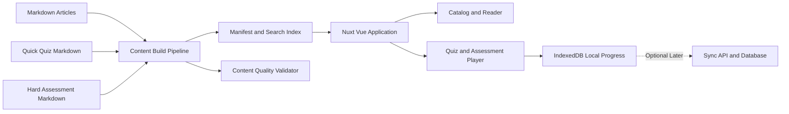

# Interview Guide Web Platform：網站化、互動測驗與學習紀錄規劃書

- **規劃基準日**: 2026-08-12
- **文件狀態**: 提案與執行基準
- **適用範圍**: 全部主題文章、`QUIZ/`、Hard Assessment 與未來 `web/` 應用程式
- **內容治理基準**: [Assessment Roadmap](./QUIZ/ASSESSMENT_ROADMAP.md)
- **測驗規格**: [Assessment Spec](./QUIZ/ASSESSMENT_SPEC.md)

## 一、決策摘要

本專案下一階段將從 Markdown 面試指南擴展成可瀏覽、可互動測驗、可追蹤學習弱點的網站。網站不是另一份內容來源，而是現有知識庫的使用介面。

### 已採用的方向

1. **前端採用 Vue 3 + TypeScript**。
2. **應用框架優先採用 Nuxt**，以取得路由、SEO、靜態產出、未來 server API 與登入整合能力。
3. **現有 Markdown 保持唯一內容來源**，不把文章理論搬到另一套 CMS。
4. **建置時產生 Content Manifest**，網站讀取結構化索引，不在瀏覽器執行期掃描全部 Markdown。
5. **網站程式放在獨立的 `web/` 目錄**，避免前端建置檔污染知識庫的目錄結構。
6. **第一版採 local-first**：使用瀏覽器本地資料庫保存測驗紀錄，之後再加入登入與跨裝置同步。
7. **Quick Quiz 自動計分；Hard Assessment 先採 Rubric 自評與作答紀錄**，不把 AI 評分列入 MVP 的唯一判定依據。

### 核心學習閉環

```text
分類瀏覽 → 閱讀文章 → Quick Quiz → Hard Assessment
    → 分析錯誤 Learning Objective → 回讀文章 → 重測
```

## 二、目前基礎與限制

目前內容治理已提供網站化所需的主要關聯：

| 項目 | 現況 |
| :--- | :--- |
| 主題文章 | 553 篇 |
| 分類 Quick Quiz | 28 份、567 題 |
| Hard Assessment | 52 份 |
| Concept／Learning Objectives | 553 篇文章均已建立 |
| Article → Quiz → Assessment | 553 篇文章均已完成對應 |
| 品質檢查 | Go validator、Markdown 連結檢查與 GitHub Actions CI |
| 現有前端 | 尚未建立 Vue／Nuxt 應用程式 |

目前專案沒有既有 `package.json`、Vite／Nuxt 設定或前端 `src/`。因此應先建立清楚的網站邊界，再逐步接入內容，而不是把前端檔案散落到現有文章目錄。

## 三、產品目標與非目標

### 3.1 產品目標

- 讓使用者依分類、標籤、難度、重要程度、Concept 與前置知識瀏覽內容。
- 將文章、Quick Quiz、Hard Assessment 串成清楚的學習順序。
- 讓 Quick Quiz 能互動作答、立即查看結果與解釋。
- 讓 Hard Assessment 能保存開放式回答、Rubric 分數、失分原因與回顧紀錄。
- 以 Learning Objective 為單位產生「不熟概念」與下一步複習建議。
- 即使沒有帳號，也能在同一個瀏覽器保留學習進度。
- 後續可以加入登入、跨裝置同步與個人化學習路徑，而不必重寫內容層。

### 3.2 MVP 不包含

- 不建立另一套後台 CMS 取代 Markdown。
- 不在第一版導入 AI 作答評分或讓 AI 分數直接決定是否通過。
- 不先實作社群、排行榜、留言與多人協作。
- 不要求第一天就完成 567 題的完整結構化轉換；先以小批次建立內容契約，再擴大遷移。
- 不在尚未驗證資料模型前引入帳號、付費與複雜權限。

## 四、目標技術架構



### 4.1 Content Build Pipeline

建置流程負責把 Markdown 的穩定識別資料轉成網站使用的 manifest：

1. 掃描主題文章、分類 Quiz 與 Hard Assessment。
2. 解析文章的標題、分類、相對路徑、難度、重要程度、標籤、Prerequisites、Concept ID 與 Learning Objectives。
3. 解析文章到 Quick Quiz 與 Hard Assessment 的連結。
4. 解析 Quiz 題目的穩定 ID、Concept、LO、題型與可評分欄位。
5. 解析 Assessment ID、Concept 集合、LO 集合、作答區塊、Rubric 與通過門檻。
6. 產生內容 manifest、搜尋索引與文章路由表。
7. 重用現有 Go validator，並在網站建置前阻擋 ID、連結、映射或 schema 錯誤。

網站只消費建置結果；文章內容仍由 Markdown 維護。

### 4.2 為什麼不在瀏覽器直接解析所有 Markdown

- 解析時間與初始 bundle 會隨 732 個 Markdown 檔案增加。
- Markdown 內同時存在文章、程式碼範例、HTML details、連結與治理註記，執行期解析容易產生不一致。
- 建置時可以在發布前發現死連結、重複 ID、缺少 LO 或測驗沒有回指文章。
- 搜尋、分類與弱點分析都需要結構化資料，應該一次建置後重用。

## 五、內容與資料模型

### 5.1 Article Record

每篇文章至少需要提供：

| 欄位 | 用途 |
| :--- | :--- |
| `articleId` | 網站內穩定文章識別，不直接依賴顯示標題 |
| `slug` | 閱讀頁路由 |
| `categoryId` | 分類瀏覽與導覽 |
| `title` | 顯示標題 |
| `conceptId` | 與 Quiz、Assessment、學習紀錄關聯 |
| `learningObjectives` | 由 `LO-1`、`LO-2`、`LO-3` 組成的可觀察目標 |
| `difficulty`／`importance` | 篩選、推薦與學習排序 |
| `tags`／`prerequisites` | 搜尋與前置知識提示 |
| `quickQuizIds`／`assessmentIds` | 學習閉環入口 |
| `contentHash` | 內容更新後辨識歷史紀錄是否需要重新作答 |

`Concept ID` 與 `Learning Objective ID` 是跨文章、Quiz、Assessment 與紀錄的核心關聯鍵，不應使用標題文字作為關聯依據。

### 5.2 Quick Quiz Item

目前 Quick Quiz 以適合閱讀的 Markdown 為主；要支援自動計分，需要逐步補上機器可讀欄位：

- `questionId`
- `conceptId`
- `learningObjectiveIds`
- `type`：single choice、multiple choice、true／false，後續才考慮短答
- `prompt` 或對應 Markdown anchor
- `options`
- `correctOptionIds`
- `explanation`
- `articlePath`
- `difficulty`

長篇答案提示與理論仍保留在 Markdown。機器可讀資料只承擔題型、選項、正解、解釋與關聯，避免把整篇文章重複複製到前端資料檔。

### 5.3 Hard Assessment

Hard Assessment 應提供：

- `assessmentId` 與版本。
- 主要與次要 Concept IDs。
- 完整 Learning Objective IDs。
- 題目情境、限制條件與作答要求。
- 作答區塊或任務分段。
- 期待證據。
- Rubric 維度、0–4 分與通過門檻。
- 參考答案的延後顯示規則。
- 對應文章路徑。

第一版不嘗試判斷開放式回答是否「客觀正確」。使用者提交答案後，網站保存回答，讓使用者依既有 Rubric 自評；這比用不透明的自動評分製造錯誤信心更可靠。

### 5.4 學習紀錄

紀錄必須以「一次嘗試」與「Concept／LO 累積狀態」分離：

| 紀錄 | 內容 |
| :--- | :--- |
| Quiz Attempt | 題目、選項、是否正確、得分、作答時間、內容版本 |
| Assessment Attempt | 作答內容、Rubric 各維度分數、總分、通過狀態、失分筆記 |
| Objective Progress | LO 的答題次數、近期正確率、Hard Assessment 表現、信心與最後複習時間 |
| Study Session | 開始／結束時間、閱讀文章、完成測驗與中途離開狀態 |
| User Settings | 顯示偏好、複習節奏、是否顯示參考答案 |

每筆紀錄都應保留 `contentVersion` 或 `contentHash`。文章或測驗更新後，歷史分數仍要能解釋，不應被新題目覆寫。

## 六、網站資訊架構與主要路由

### 6.1 主要頁面

| 路由概念 | 功能 |
| :--- | :--- |
| 首頁 | 今日進度、推薦複習、分類入口、最近錯誤 |
| 分類頁 | 依六大分類與子分類瀏覽 |
| 搜尋／探索頁 | 依標籤、難度、重要程度、Concept、LO 篩選 |
| 文章頁 | 正文、目錄、Prerequisites、Learning Objectives、測驗入口 |
| Quick Quiz 頁 | 題目作答、即時或提交後計分、答案解釋 |
| Hard Assessment 頁 | 情境閱讀、分段作答、Rubric 自評、參考答案 |
| 進度 Dashboard | 完成率、正確率、弱點 LO、最近紀錄 |
| 複習佇列 | 依錯題、低分、低信心與久未複習排序 |
| 設定／資料 | 匯出、匯入、清除本地資料與顯示偏好 |

### 6.2 單篇文章頁的固定資訊

文章頁不只顯示正文，還應在側欄或文章結尾提供：

1. Concept ID 與文章分類。
2. Learning Objectives 勾選狀態。
3. Prerequisites 與建議前置文章。
4. Quick Quiz 入口。
5. Hard Assessment 入口。
6. 個人上次作答結果與弱點提示。

這會把現有的「文章 → Quiz → Hard Assessment」規則轉成真正可操作的介面。

## 七、測驗互動與評分設計

### 7.1 Quick Quiz

MVP 先支援封閉式題型：

- 單選題。
- 多選題。
- 是非題。

作答流程：

1. 顯示題目與目前進度。
2. 支援上一題、下一題、暫存與重新開始。
3. 提交後顯示正確與否、解釋、對應文章與 LO。
4. 將錯誤記錄到 Objective Progress。
5. 提供「立即回讀文章」與「加入複習佇列」。

短答題先只保存回答與自評，不在 MVP 自動判分；避免用關鍵字比對誤判概念理解。

### 7.2 Hard Assessment

Hard Assessment 的互動介面應保留情境推理，而不是改造成大量選擇題：

- 先閱讀情境與限制。
- 依作答要求分段輸入回答。
- 提交後才顯示參考答案與詳解。
- 依 Rubric 維度輸入 0–4 分。
- 記錄各維度失分原因與下一步補強。
- 允許重新作答，保留每一次嘗試與內容版本。

靜態網站無法真正防止使用者查看已下載的參考答案；MVP 將它視為自學工具。若未來需要正式考試模式，再將答案與評分放到 server API，並加入登入、時間限制與提交鎖定。

### 7.3 弱點 Concept／LO 判定

弱點分析先採透明規則，不使用黑盒模型。可綜合：

- 最近 Quick Quiz 錯誤。
- 同一 LO 的重複錯誤。
- Hard Assessment Rubric 低於通過線。
- 使用者自評信心低。
- 長時間未複習。

Dashboard 應清楚說明「為什麼被判定為弱點」，例如「最近三次答題錯兩次」或「Hard Assessment 的一致性維度為 2/4」，讓使用者可以信任並修正結果。

## 八、內容正規化與遷移策略

不一次重寫全部 567 題，而採下列順序：

### Phase W0：內容契約與試點

- 定義 Article、Quiz、Assessment、Attempt 與 Objective Progress schema。
- 選一個分類作為試點，建議先用 Go 或資料庫。
- 為試點題目補穩定 `questionId`、題型、選項與正解。
- 建立 manifest 產生器與 validator 整合。
- 驗證 Markdown 顯示內容與 machine-readable 欄位不漂移。

**完成條件**：至少一個分類可以從文章一路進入 Quiz 與 Assessment，且重新建置後 ID、連結與結果一致。

### Phase W1：全庫瀏覽

- 建立 `web/` Nuxt 應用程式。
- 接入全部 553 篇文章的分類、搜尋、標籤、難度與重要程度。
- 建立文章頁與測驗入口。
- 支援桌面與手機閱讀、目錄與鍵盤操作。

**完成條件**：553 篇文章均有可用路由；任一文章都能看見正確 Concept、LO、Quick Quiz 與 Hard Assessment 入口。

### Phase W2：Quick Quiz MVP

- 先完成試點分類的自動評分。
- 再依分類批次擴展到 567 題。
- 加入作答暫存、提交、重做、解釋與錯題回讀。
- 將每次作答寫入 IndexedDB。

**完成條件**：重新整理頁面或離線後，作答紀錄仍可恢復；錯題能回指到 Concept、LO 與原文。

### Phase W3：Hard Assessment MVP

- 建立情境、作答區、Rubric、參考答案與延後顯示。
- 支援 52 份 Assessment 的索引與逐步接入。
- 保存完整回答、Rubric 分數、通過狀態與失分筆記。

**完成條件**：使用者能完成一次 Hard Assessment、自評、查看結果，並在 Dashboard 看見對應弱點 LO。

### Phase W4：學習 Dashboard 與複習佇列

- 顯示分類進度、Concept 覆蓋、LO 掌握度與測驗趨勢。
- 產生「待複習」與「建議下一題」清單。
- 支援依錯誤、低分、低信心與久未複習排序。
- 加入資料匯出／匯入，避免本地資料無法搬移。

**完成條件**：使用者可以回答「我哪裡不熟、為什麼被判定不熟、下一步該讀什麼」。

### Phase W5：帳號與跨裝置同步

- 加入登入與匿名本地資料轉移。
- 建立 sync API 與雲端資料庫。
- 為嘗試紀錄使用 append-only 或版本化同步策略。
- 處理同一筆紀錄在多個裝置上的衝突。
- 保留離線操作與恢復上傳能力。

**完成條件**：使用者可在不同裝置看到一致的文章進度、Quiz attempt 與 Assessment attempt，且不遺失本地資料。

## 九、儲存與同步策略

### 9.1 MVP：Local-first

- 使用 IndexedDB，而不是只使用 `localStorage`。
- 以 `contentVersion`、`attemptId` 與時間戳辨識紀錄。
- 每次提交先寫入本地，再更新畫面。
- 提供 JSON 匯出與匯入。
- 清除資料前要求二次確認，並提供匯出提醒。

### 9.2 後續：Optional Sync

未來可採 Nuxt server API 加關聯式資料庫，但同步層必須晚於本地資料模型穩定後建立。伺服器不應重新解讀 Markdown；它只保存使用者、嘗試紀錄、學習狀態與同步版本。

同步優先採 append-only attempt：

- 歷史作答不可被新裝置覆蓋。
- Objective Progress 可以由 attempts 重算。
- 同步衝突以事件時間與內容版本處理。
- 使用者刪除資料時必須有明確的刪除語意與回應。

## 十、品質、測試與 CI

網站化不能削弱目前的內容品質閘門，CI 應增加以下檢查：

### Content Pipeline

- 現有 `go run ./scripts/validate_assessments.go`。
- Manifest schema validation。
- Article、Quiz、Assessment 的 ID 唯一性。
- 所有文章都有有效測驗映射。
- 所有網站路由都能由 manifest 產生。
- Markdown 連結與 article／quiz／assessment 關聯一致。

### Web Application

- Content parser／manifest unit tests。
- Quiz scoring unit tests。
- Objective weakness calculation unit tests。
- Article、Quiz、Assessment 主要元件測試。
- E2E：分類 → 文章 → Quiz → 結果 → Dashboard。
- E2E：文章 → Hard Assessment → Rubric → 弱點 LO。
- IndexedDB schema migration tests。
- 手機版、鍵盤操作、焦點管理與色彩對比檢查。

### CI 建議順序

1. Go content validator。
2. Manifest 產生與 schema 檢查。
3. TypeScript typecheck 與 lint。
4. Unit／component tests。
5. Web production build。
6. 最小 E2E smoke test。

任何內容映射錯誤或前端無法建置時，CI 應阻止發布。

## 十一、部署策略

### 第一階段：靜態部署

在只有 Markdown、manifest 與 IndexedDB 時，可先使用 Nuxt 靜態產出。優點是成本低、部署簡單、離線學習可行，也不需要先處理登入與個資。

### 第二階段：應用程式部署

當需要登入、同步或正式考試模式，再切換到具備 server API 的部署方式。此時才引入資料庫、session／token、rate limit、備份與監控。

## 十二、主要風險與對策

| 風險 | 影響 | 對策 |
| :--- | :--- | :--- |
| Markdown 與結構化題目資料漂移 | 題目、正解與文章關聯錯誤 | 穩定 ID、manifest schema、CI 雙向檢查 |
| 一次轉換全部 567 題 | 遷移時間長且難以定位問題 | 先做單一分類試點，再按批次遷移 |
| Hard Assessment 無法可靠自動評分 | 產生錯誤的掌握度 | MVP 採 Rubric 自評，AI 僅作未來輔助 |
| 靜態網站暴露參考答案 | 正式考試模式容易被查看 | 自學模式接受；正式模式改由 server 延後提供 |
| 只用 localStorage 保存紀錄 | 資料容量、版本與恢復能力不足 | IndexedDB 加匯出／匯入 |
| 內容更新後歷史分數失真 | 使用者無法理解舊結果 | 保存 content hash／version |
| Dashboard 只顯示總分 | 無法定位真正弱點 | 以 Concept 與 LO 為最小分析單位 |
| 前端功能與內容治理分離 | 網站看似成功但資料失效 | 將 Go validator 與 manifest build 納入同一個 CI |

## 十三、MVP 驗收標準

MVP 完成時必須滿足：

- 553 篇文章都能依分類與搜尋找到。
- 任一文章都顯示 Concept、Learning Objectives、Prerequisites 與測驗入口。
- 至少一個完整分類可執行 Quick Quiz、自動計分並保存紀錄。
- 至少一份 Hard Assessment 可輸入回答、Rubric 自評與保存結果。
- 刷新頁面、重新開啟瀏覽器或離線後，紀錄仍可恢復。
- Dashboard 能列出至少一個依 LO 排序的弱點或複習項目。
- 內容更新不會產生重複 ID、失效連結或測驗孤兒資料。
- 現有 Go validator 與新增 web test／build 全部通過。
- 手機與鍵盤使用者能完成主要學習流程。

## 十四、第一批執行清單

接下來不直接實作全部功能，而依以下順序建立可驗證垂直切片：

1. 建立 `web/` Nuxt 應用程式骨架與最小 CI。
2. 定義 Article、Quiz、Assessment、Attempt 與 Progress 的 schema。
3. 實作一個分類的 manifest 產生器與內容路由。
4. 完成文章列表、文章頁與 Concept／LO 測驗入口。
5. 將一個分類的 Quick Quiz 正規化成可自動計分格式。
6. 實作 IndexedDB attempt 保存、恢復與匯出。
7. 用一份 Hard Assessment 驗證開放式作答與 Rubric 流程。
8. 先完成垂直切片驗收，再擴展到全庫。

每個可審查批次都應獨立 commit，並至少執行內容 validator、web build、測試與 `git diff --check`。

## 十五、決策紀錄

| 決策 | 理由 |
| :--- | :--- |
| Vue 作為 UI 技術 | 與現有前端學習內容一致，元件化與互動測驗足夠成熟 |
| Nuxt 作為應用框架 | 同時支援內容瀏覽、SEO、路由、靜態部署與未來 server API |
| Markdown 保持 source of truth | 避免網站化後產生第二套難以同步的知識庫 |
| Manifest 建置模式 | 提升效能、可驗證性與搜尋／統計能力 |
| `web/` 與內容分離 | 保持既有知識庫乾淨，降低前端工具鏈對 Markdown 的影響 |
| IndexedDB 優先 | 先提供無帳號學習紀錄，再以真實使用需求決定同步複雜度 |
| Rubric 自評優先 | Hard Assessment 是推理題，先保留評分透明度，再評估 AI 輔助 |
